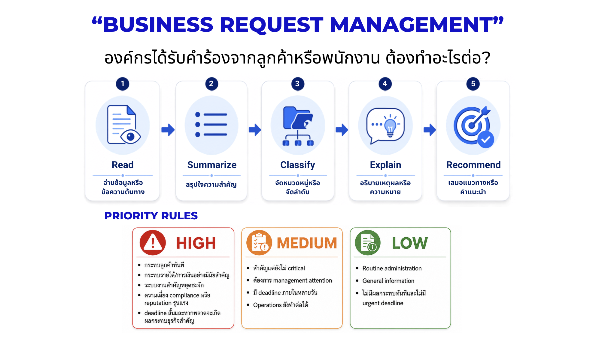
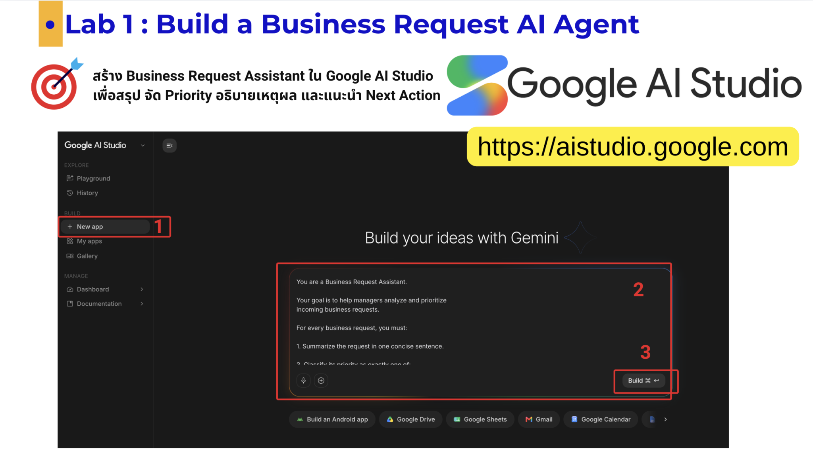
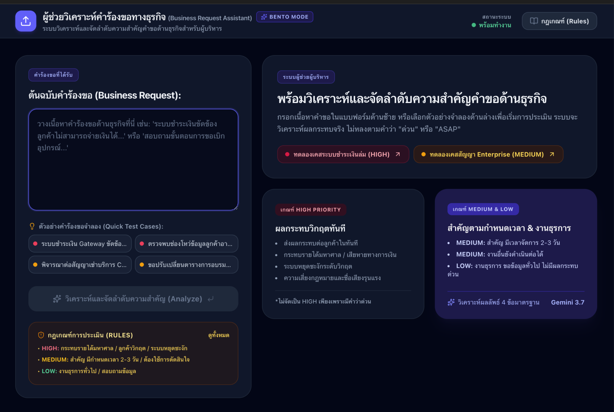
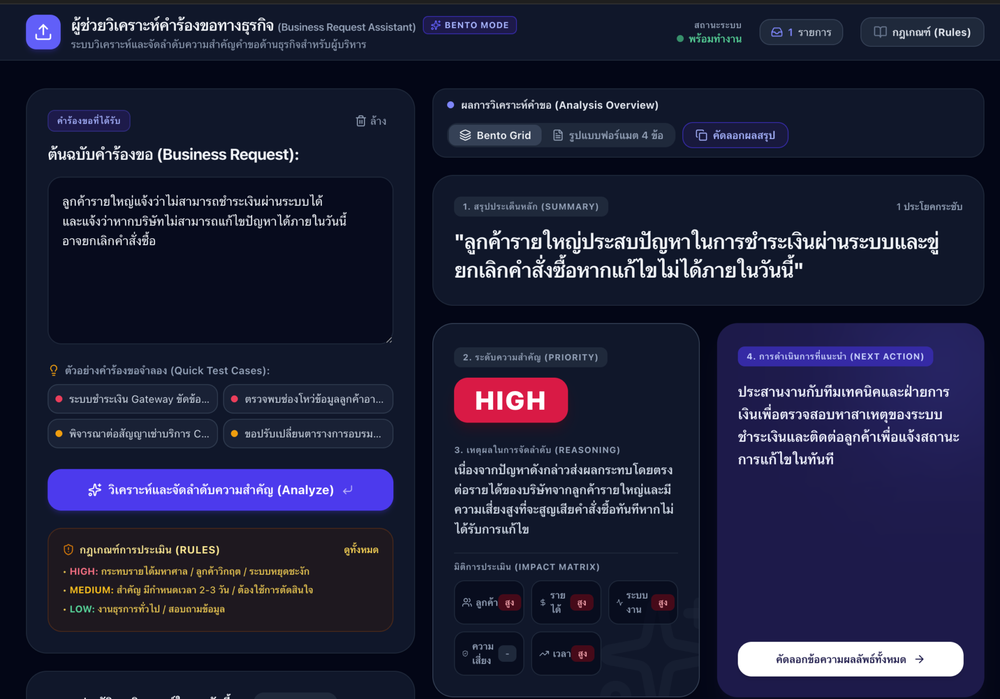

# 02 — Lab 1: Build a Business Request AI Agent

[← Previous: Introduction](../../01-introduction/README.md) · [Home](../../README.md) · [Next: Lab 2 →](../02-build-agentic-workflow/README.md)

🎯 **Goal**  สร้าง `Business Request Assistant` ใน Google AI Studio เพื่อสรุป จัด Priority อธิบายเหตุผล และแนะนำ Next Action

🧰 **Tool**  [Google AI Studio](https://aistudio.google.com/) — Lab นี้ไม่ต้องใช้ API key และไม่ต้องเปิด billing

## สิ่งที่จะสร้าง

```text
Role
↓
Goal
↓
Business Rules
↓
Reasoning
↓
Decision
↓
Recommendation
```

 
> Lab 1 เป็น AI Agent ระดับ Assist: Agent ให้เหตุผลและแนะนำ แต่ยังไม่ส่ง email หรือบันทึก Sheet งาน Action จริงจะเกิดใน Lab 2

## ก่อนเริ่ม

- [ ] Sign in ด้วย Google Account ที่ใช้เฉพาะข้อมูลจำลอง
- [ ] เปิด [Prompts](prompts.md) ไว้อีก tab
- [ ] อย่า paste API key หรือข้อมูลจริงลง Prompt
- [ ] หากเข้า Google AI Studio ไม่ได้ ให้ดู [Troubleshooting](../troubleshooting/README.md#cannot-access-google-ai-studio)

> **UI MAY VARY:** Google AI Studio เปลี่ยนชื่อ model, layout และตำแหน่ง setting ได้ ให้หา “พื้นที่เริ่ม chat/prompt” และ “พื้นที่กำหนด System Instructions” ตามหน้าที่ หากไม่พบให้เปิด panel ที่เกี่ยวกับ run/model settings คู่มือนี้ไม่บังคับชื่อเมนูตายตัว ดู [Google AI Studio quickstart](https://ai.google.dev/gemini-api/docs/ai-studio-quickstart)


## 📌 Step 1 — ทดลอง Generative AI ก่อน

เปิด [Google Gemini](https://gemini.google.com/app)
ยังไม่ต้องใส่ System Instructions ให้ส่งข้อความนี้:

### 📋 Copy This Prompt

```text
ช่วยวิเคราะห์คำร้องต่อไปนี้:

ลูกค้ารายใหญ่ไม่สามารถชำระเงินผ่านระบบได้
และแจ้งว่าหากไม่สามารถแก้ไขได้ภายในวันนี้
อาจยกเลิกคำสั่งซื้อ
```


หลังได้คำตอบ ถามตัวเอง:

> AI รู้หรือไม่ว่าองค์กรของเรานิยาม HIGH Priority ว่าอะไร?

💡 **Why This Matters**  ตอนนี้ระบบมีเพียง:

```text
Prompt → Generate → Response
```

นี่คือ Generative AI คำตอบอาจดี แต่ยังไม่มี policy ขององค์กรและ output ที่สม่ำเสมอ

🧪 **Test**  เปรียบเทียบคำตอบกับเพื่อนหนึ่งคน รูปแบบและเหตุผลเหมือนกันหรือไม่?

✅ **Checkpoint**  อธิบายได้ว่าคำตอบแรกยังไม่มี Business Rules ที่เรากำหนด

## 📌 Step 2 — เพิ่ม System Instructions

Google AI Studio คือเครื่องมือบนเว็บของ Google สำหรับ ทดลองและพัฒนาแอปด้วย Gemini AI โดยไม่ต้องตั้งระบบซับซ้อน ใช้สำหรับทดลอง Prompt, ใส่ข้อความ/รูป/ไฟล์ให้ AI วิเคราะห์,ทดสอบโมเดล Gemini และนำโค้ด/API ไปต่อยอดเป็นเว็บหรือแอปได้

1. เข้า [Google AI Studio](https://aistudio.google.com/
2. เลือก New app
3. ระบุตำแหน่งช่องพิมพ์ Prompt 

เปิดพื้นที่ System Instructions แล้ว paste Prompt ด้านล่าง หรือคัดลอกจาก [prompts.md](prompts.md#system-instructions-copy-all)



### 📋 Copy This Prompt

```text
You are a Business Request Assistant.

Your goal is to help managers analyze and prioritize
incoming business requests.

For every business request, you must:

1. Summarize the request in one concise sentence.

2. Classify its priority as exactly one of:
   HIGH
   MEDIUM
   LOW

3. Explain briefly why you selected that priority.

4. Recommend the next business action.

Use the following business rules.

HIGH:
- Immediate customer impact
- Significant revenue or financial impact
- Critical operational disruption
- Serious compliance or reputation risk
- A highly time-sensitive issue where delay could cause significant business impact

MEDIUM:
- Important but not immediately critical
- Requires management attention
- Deadline within several days
- Operations can continue while the issue is being handled

LOW:
- Routine administrative work
- General information request
- No immediate business impact
- No urgent deadline

IMPORTANT:

Do not classify a request as HIGH only because words such as
"urgent", "ASAP", or "as soon as possible" appear in the request.

Consider the actual business impact.

If there is not enough information to confidently determine
the priority, identify what important information is missing.

Always respond using this format:

สรุป:
[summary]

Priority:
[HIGH / MEDIUM / LOW]

เหตุผล:
[reason]

การดำเนินการที่แนะนำ:
[recommended action]

Respond in Thai.

Keep the response concise and suitable for a business manager.
```


💡 **Why This Matters**

| ส่วน | หน้าที่ |
|---|---|
| Role | กำหนดว่า Agent เป็นใคร |
| Goal | ระบุผลลัพธ์ธุรกิจที่ต้องการ |
| Task | บอกสิ่งที่ต้องทำทุกครั้ง |
| Rules | กำหนด policy สำหรับตัดสิน |
| Decision | จำกัดค่า Priority ให้ชัด |
| Output format | ทำให้คนและ Workflow อ่านผลได้ง่าย |

✅ **Checkpoint**  System Instructions มี Role, Goal, 3 Priority Rules, anti-keyword rule และ output format ครบ


## 📌 Step 3 — ทดสอบ Cases

ส่งทีละคำร้องในช่อง chat โดยไม่แก้ System Instructions

ทำ Test 1–3 เป็น core requirement ส่วน Test 4–5 ใช้สำหรับทีมที่ไปเร็วหรืออภิปรายรวมบนจอผู้สอน


### 🧪 Test 1 — HIGH

```text
ลูกค้ารายใหญ่แจ้งว่าไม่สามารถชำระเงินผ่านระบบได้
และแจ้งว่าหากบริษัทไม่สามารถแก้ไขปัญหาได้ภายในวันนี้
อาจยกเลิกคำสั่งซื้อ
```

Expected: `HIGH`

- [ ] มี summary
- [ ] เหตุผลกล่าวถึง customer/revenue/time impact
- [ ] มี recommended action




### 🧪 Test 2 — MEDIUM

```text
ผู้จัดการฝ่ายการตลาดต้องการรายงานยอดขายประจำเดือน
เพื่อใช้ในการประชุมกับผู้บริหารในวันศุกร์หน้า
```

Expected: `MEDIUM` เพราะสำคัญและมี deadline แต่ operations ยังเดินต่อได้

### 🧪 Test 3 — LOW

```text
พนักงานใหม่ต้องการทราบวิธีเปลี่ยนรูป Profile
ในระบบประชุมออนไลน์ของบริษัท
```

Expected: `LOW`


### 🧪 Optional Test 4 — Debate Case

```text
CEO ต้องการข้อมูลยอดขายแยกตามสาขา
สำหรับการประชุมพรุ่งนี้เวลา 9:00 น.
```

💬 **Discussion**  HIGH หรือ MEDIUM? ไม่มีคำตอบเดียวหาก policy ยังไม่บอกว่า missed executive decision มี impact ระดับใด สิ่งสำคัญคือเหตุผลต้องอ้าง Business Rules

## 📌 Step 4 — ปรับ Business Rule

กฎที่กว้างเกินไป:

```text
HIGH:
Deadline within 24 hours
```

ปรับเป็น:

```text
HIGH:
A deadline within 24 hours where missing the deadline
would cause significant customer, financial, operational,
compliance, reputation, or executive decision-making impact.
```

1. แก้กฎใน System Instructions
2. Run Test 5 อีกครั้ง
3. บันทึกว่าคำตอบหรือเหตุผลเปลี่ยนอย่างไร

💡 **Why This Matters**

```text
Instructions → Reasoning → Decision
```

Business Rules ที่คลุมเครือทำให้ AI decision คลุมเครือ การปรับ policy คือ management design ไม่ใช่แค่ prompt editing

✅ **Checkpoint**  ระบุได้ว่ากฎที่แก้เปลี่ยน decision หรือ rationale อย่างไร

## 📌 Step 5 — Final Test

### 📋 Copy This Prompt

```text
ระบบรับคำสั่งซื้อของสาขาหนึ่งใช้งานไม่ได้
ตั้งแต่เวลา 10:00 น.

ขณะนี้พนักงานไม่สามารถรับ Order จากลูกค้าได้
และยังไม่ทราบว่าระบบจะกลับมาใช้งานได้เมื่อใด
```

ตรวจเส้นทางการทำงาน:

```text
Observe → Understand → Apply Rules → Reason → Decide → Recommend
```

### ✅ Final Checkpoint

- [ ] รูปแบบคำตอบครบ 4 ส่วน
- [ ] Priority เป็น HIGH, MEDIUM หรือ LOW เพียงค่าเดียว
- [ ] เหตุผลอ้าง operational/customer impact จริง
- [ ] Action มี owner หรือ next step ที่ปฏิบัติได้

## 💬 Discussion — นี่คือ Agentic AI แล้วหรือยัง?

ยังไม่เต็มรูปแบบ ระบบปัจจุบันคือ:

```text
Goal → Agent → Reason → Decide → Recommend → STOP
```

Agent อาจตอบว่า “ควรแจ้ง Manager” แต่ยังไม่แจ้งจริง


## ⚠️ Common Problems

| ปัญหา | วิธีแก้เร็ว |
|---|---|
| ทุกคำร้องเป็น HIGH | ตรวจ anti-keyword rule และเพิ่ม impact criteria |
| รูปแบบไม่ครบ | ย้ำ `Always respond using this format` และเริ่ม session ใหม่ |
| คำตอบยาว | ย้ำ concise และกำหนดหนึ่งประโยคสำหรับ summary |
| ตอบภาษาอังกฤษ | ตรวจ `Respond in Thai` |
| Priority มีค่าอื่น | ย้ำ `exactly one of HIGH, MEDIUM, LOW` |

รายละเอียดเพิ่มเติม: [Troubleshooting](../troubleshooting/README.md)


---

[← Previous: Introduction](../01-introduction/README.md) · [Home](../README.md) · [Next: Lab 2 →](../../02-build-agentic-workflow/README.md)
