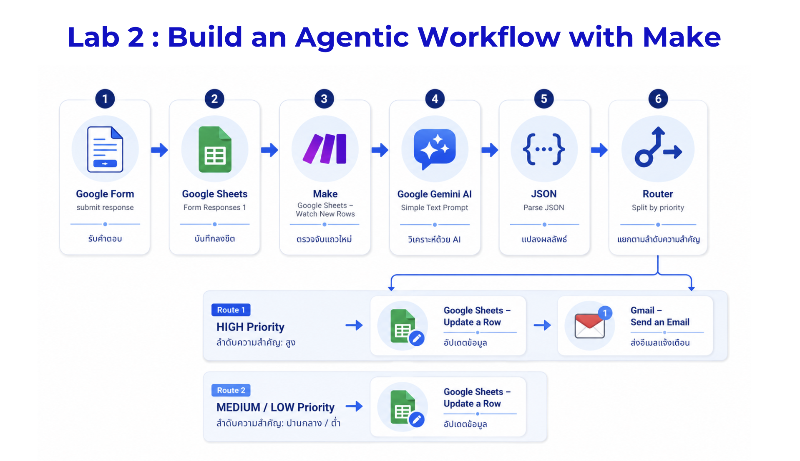
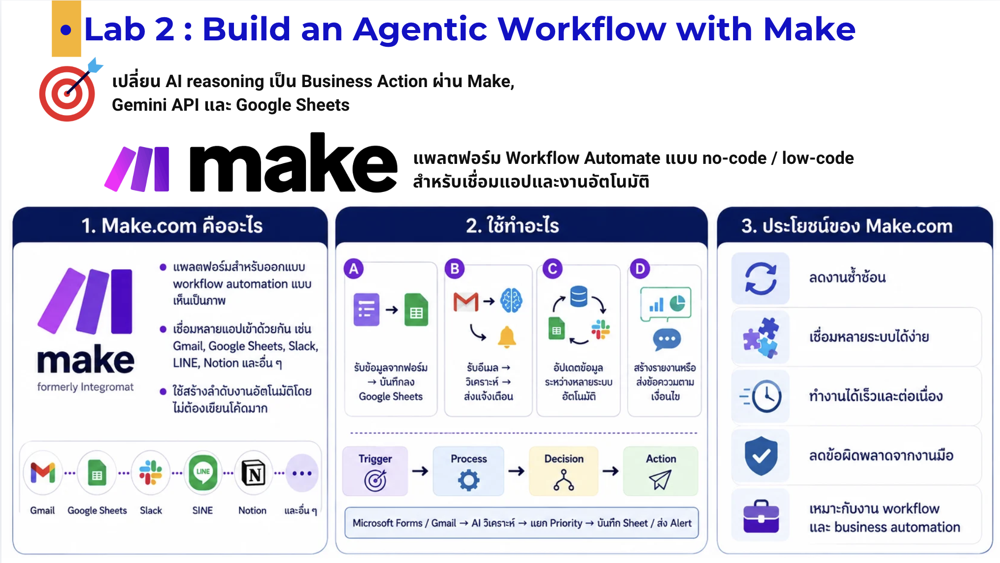
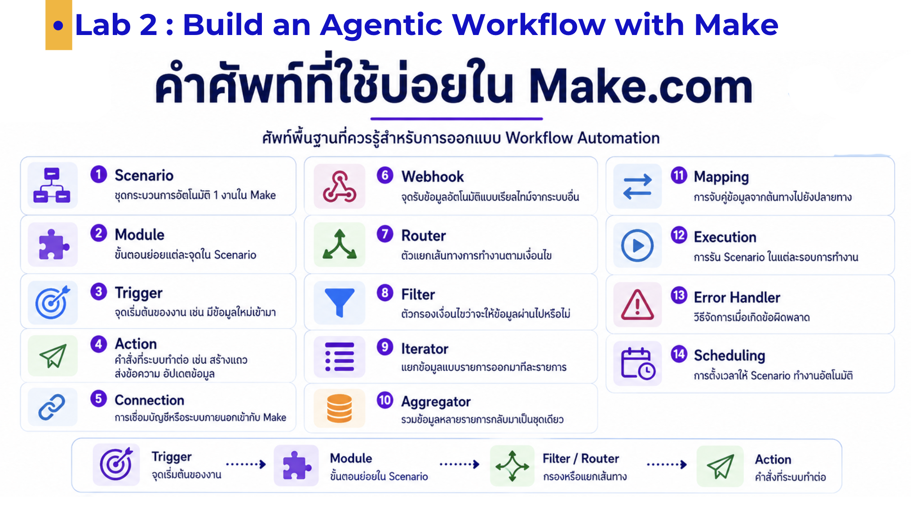
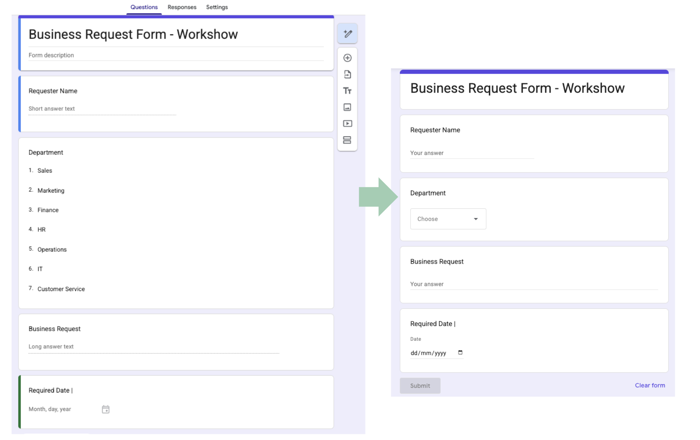
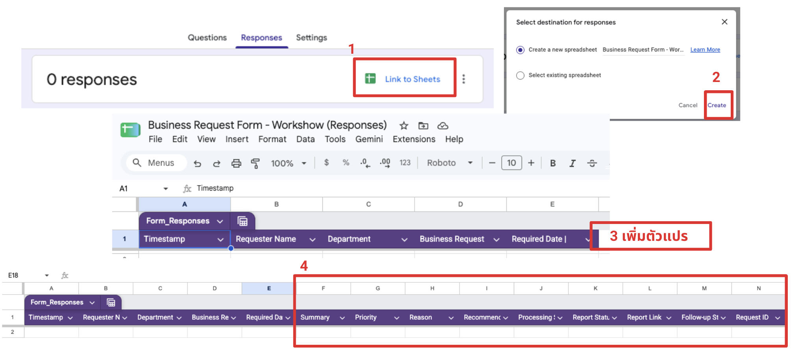
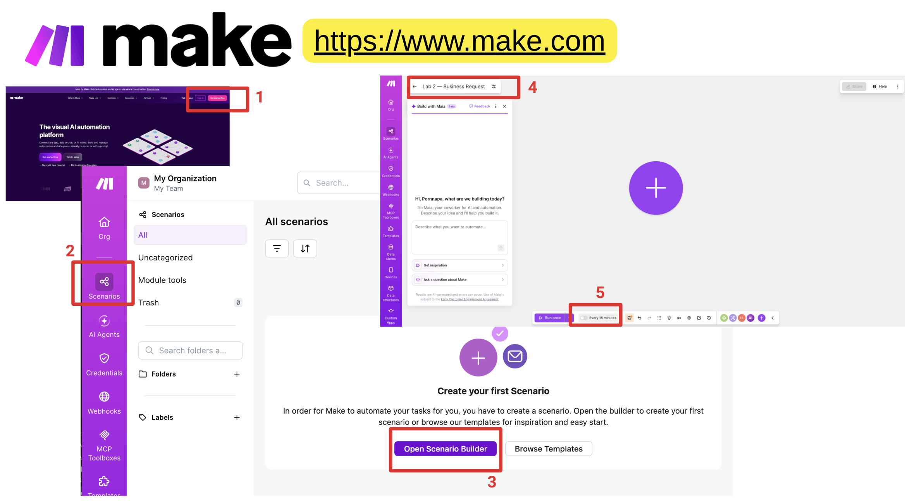
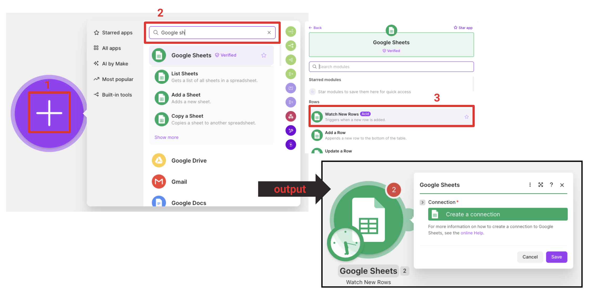
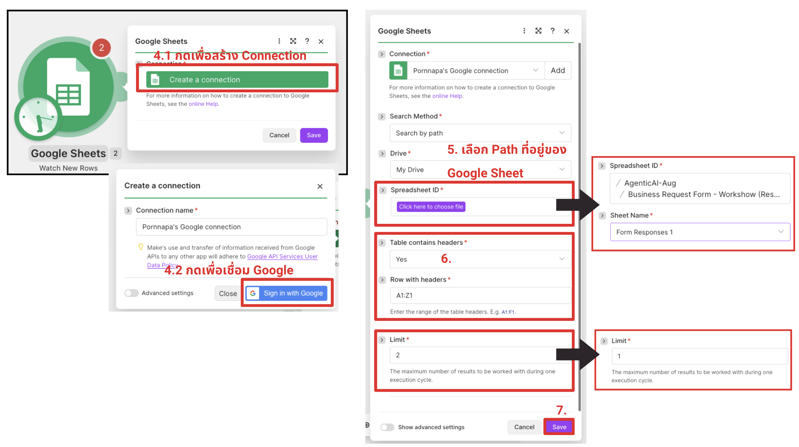
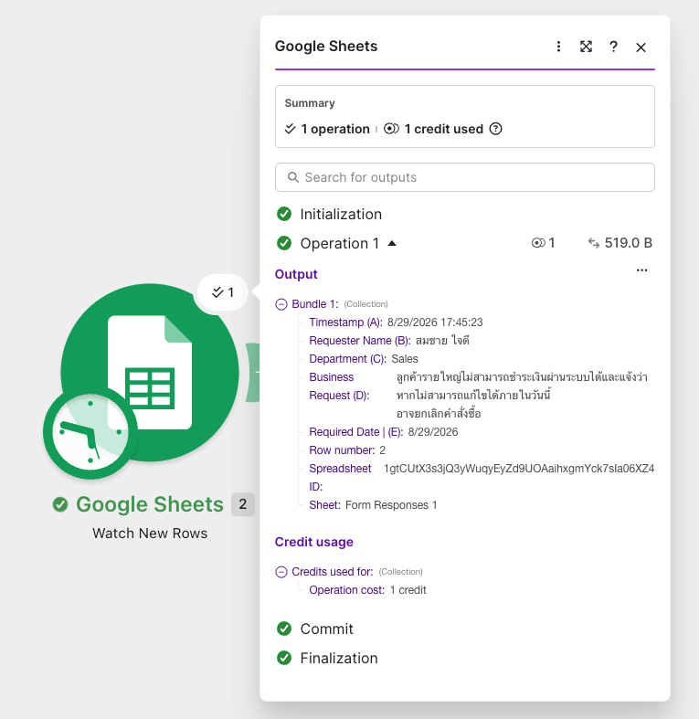
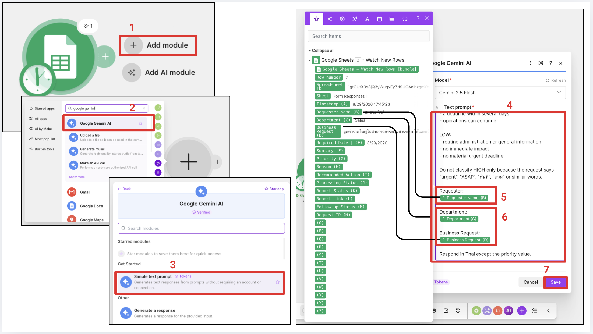

# 03 — Lab 2: Build an Agentic Workflow with Make — Step by Step

[← Previous: Lab 1](../01-build-ai-agent/README.md) · [Home](../README.md) · [Next: Lab 3 →](../03-generate-management-report/README.md)

🎯 **Goal**  รับ Business Request จาก Google Form ให้ Google Sheets เก็บคำตอบ แล้วใช้ Make + Gemini วิเคราะห์และเขียนผลกลับแถวเดิม โดยส่ง Gmail เฉพาะรายการ `HIGH`

🧰 **Tools**  Google Forms + Google Sheets + Make + Gemini API key + Gmail

## สิ่งที่จะสร้าง

## Completed Flow

```text
Google Form
↓ submit response
Google Sheets — Form Responses 1
↓
Make: Google Sheets — Watch New Rows
↓
Google Gemini AI — Simple Text Prompt
↓
JSON — Parse JSON
↓
Router
├─ Route 1: Priority = HIGH
│  ↓
│  Google Sheets — Update a Row
│  ↓
│  Gmail — Send an Email
│
└─ Route 2: Priority = MEDIUM OR LOW
   ↓
   Google Sheets — Update a Row
```


> Google Form ไม่ได้ต่อเข้า Make โดยตรงใน Flow นี้ เมื่อมีคนกด Submit คำตอบจะถูกเพิ่มใน response sheet ก่อน แล้ว `Watch New Rows` จึงอ่านแถวใหม่ไปประมวลผล

> **ส่วนที่เติมจากภาพ:** Route 2 ต้องมี `Google Sheets — Update a Row` เช่นกัน เพื่อให้ผลวิเคราะห์ของ `MEDIUM/LOW` ถูกเขียนกลับแถวเดิม ส่วน Gmail อยู่เฉพาะ Route 1

### Tool, Connector และ Workflow ใน Lab นี้

- **Channel/Input:** Google Form รับคำร้องจำลอง
- **Data Store:** Google Sheets เก็บคำตอบจาก Form และผล AI ในแถวเดียวกัน
- **Tool/Action:** `Parse JSON`, `Update a Row` และ `Send an Email`
- **Connector:** connection พร้อม authentication และ permission ที่ให้ Make เข้าถึง Gemini, Google Sheets หรือ Gmail
- **Workflow:** Make ประสาน Form response → AI → JSON → Router → Update/Alert

Connector ทำให้ระบบเข้าถึงบริการได้ แต่ไม่ได้ตัดสินว่าควรทำอะไร ใช้เฉพาะ Form, Sheet และอีเมลทดสอบตามหลัก Least Privilege ดูเพิ่มที่ [Connector ใน Glossary](../01-introduction/glossary.md#connector)

> **MCP clarification:** Lab นี้ใช้ native connectors ของ Make ไม่ได้ติดตั้ง MCP Client/Server จึงไม่ควรเรียกทุก connection ว่า MCP ดูความแตกต่างที่ [MCP ใน Glossary](../01-introduction/glossary.md#mcp-model-context-protocol)


## Make.com คือ?



## 📌 Step 1 — Create the Google Form

1. เปิด [Google Forms](https://forms.google.com/) แล้วกด `Blank form` หรือปุ่ม `+`
2. คลิกชื่อ `Untitled form` แล้วตั้งชื่อ `Business Request Form - Workshop`
3. คลิกช่องคำอธิบายใต้ชื่อ Form แล้วใส่ `ใช้ข้อมูลจำลองเท่านั้น ห้ามกรอกข้อมูลจริงหรือข้อมูลลับ`
4. กด `Settings` แล้วตรวจว่าไม่ได้เปิดเก็บ email address หรือจำกัดผู้ตอบโดยไม่จำเป็น
5. กลับแท็บ `Questions` กดปุ่ม `+` ทางขวาเพื่อเพิ่มคำถามทีละข้อ
6. เลือกชนิดคำถามจาก dropdown ด้านขวา และเปิดสวิตช์ `Required` ทั้ง 4 ข้อ:

| Question | Type | Example |
|---|---|---|
| Requester Name | Short answer | `Demo Customer` |
| Department | Dropdown | `Sales`, `Marketing`, `Finance`, `HR`, `Operations`, `IT`, `Customer Service` |
| Business Request | Paragraph | `ลูกค้ารายใหญ่ไม่สามารถชำระเงินผ่านระบบได้...` |
| Required Date | Date | `เวลาที่ต้องการ.` |

7. สำหรับ Department ให้เลือกชนิด `Dropdown` แล้วเพิ่มตัวเลือกตามตาราง
8. กดไอคอนรูปตาด้านบนเพื่อ `Preview` แต่ยังไม่ต้อง Submit
9. อย่าแชร์ Form เป็นสาธารณะ ใช้ลิงก์ทดสอบกับตนเองหรือภายในห้องเท่านั้น



💡 **Why This Matters**  Form เป็น Channel/Input ที่กำหนดโครงสร้างข้อมูลก่อนเข้า Workflow แต่ตัว Form เองไม่ใช่ Agent

✅ **Checkpoint**  เปิด Preview แล้วเห็น 4 คำถาม  แต่ยังไม่ต้องกด Submit

## 📌 Step 2 — Link Form Responses to Google Sheets

1. กลับจาก Preview มาหน้าแก้ไข Form
2. เปิด tab `Responses` ด้านบน
3. คลิกไอคอน Google Sheets สีเขียว หรือเมนู `More` → `Select destination for responses`
4. เลือก `Create a new spreadsheet`
5. ตั้งชื่อ `Business Request Log` แล้วกด `Create`
6. เปิด Spreadsheet ที่สร้างขึ้น และเลือก tab เช่น `Form Responses 1`
7. ตรวจ 5 headers แรกที่ Google Forms สร้างให้อัตโนมัติ
8. คลิกเซลล์ F1 แล้วเพิ่ม result/tracking columns ทางขวาทีละช่องจนถึง M1:

```text
Timestamp
Requester Name
Department
Business Request
Required Date
Summary
Priority
Reason
Recommended Action
Processing Status
Report Status
Report Link
Follow-up Status
Request ID
```



💡 **Why This Matters**  Google Sheets ทำหน้าที่เป็น business data storage และ follow-up tracker แบบง่าย HIGH row จะส่งต่อให้ Lab 3 สร้าง Situation & Follow-up PDF ไม่ใช่ long-term production database


## 📌 Step 3 — Watch New Form Responses

### 3.1 สร้าง Scenario

1. เปิด [Make](https://www.make.com/) แล้วเข้าสู่ระบบ
2. จากหน้า Dashboard เลือก `Scenarios`
3. กด `Create a new scenario`
4. คลิกชื่อ Scenario ด้านบนแล้วตั้งชื่อ `Lab 2 — Business Request`
5. ตรวจว่าสวิตช์ Scheduling ยังเป็น `OFF`



### 3.2 เพิ่ม Trigger

1. คลิกวงกลม `+` กลาง canvas
2. ค้นหา `Google Sheets`
3. เลือก module `Watch New Rows`
4. ที่ช่อง Connection กด `Add` แล้วอนุญาตเฉพาะบัญชี Google ที่ใช้กับ Sheet นี้
5. ตั้งค่า module ดังนี้:

```text
Google Sheets → Watch New Rows
```

ใช้ Google Sheets connector ที่ Make รองรับ ([Make Google Sheets documentation](https://apps.make.com/google-sheets)) แล้วตั้งค่า:

- Spreadsheet: `Business Request Log`
- Sheet: `Form Responses 1` หรือชื่อ tab ที่ Form สร้างจริง
- Table contains headers: `Yes` ถ้ามีตัวเลือกนี้
- Limit: `1–3` สำหรับการทดสอบในห้อง
- Choose where to start: `From now on` สำหรับ Lab นี้

6. ถ้ามีช่อง Table/Range ให้กำหนดตั้งแต่ header row 1 และครอบคลุม A:M
7. กด `Save` หรือ `OK`




ลำดับการทดสอบ trigger:

1. กด `Run once` มุมล่างซ้ายใน Make ให้ Scenario รอแถวใหม่
2. เมื่อ module แสดงว่ากำลังรอข้อมูล ให้กลับไป Google Form
3. Submit ข้อมูลทดสอบใหม่ 1 รายการ อย่าใช้แถวที่มีอยู่ก่อนเริ่ม Run once
ตัวอย่าง
> Requester Name : สมชาย ใจดี <br>
> Department : Seles <br>
> Business Request : 	ลูกค้ารายใหญ่ไม่สามารถชำระเงินผ่านระบบได้และแจ้งว่าหากไม่สามารถแก้ไขได้ภายในวันนี้อาจยกเลิกคำสั่งซื้อ <br>
> Required Date : วันนี้

4. กลับ Make แล้วคลิกตัวเลขใน bubble เหนือ module
5. ขยาย `Bundle 1` และตรวจว่ามี `Row number`, `Timestamp`, `Request ID`, `Requester`, `Department` และ `Request`

> `Watch New Rows` เป็น scheduled trigger ไม่ใช่ instant webhook เมื่อเปิด schedule จริงอาจมีช่วงเวลารอตาม plan ของ Make สำหรับ Workshop ใช้ `Run once` ได้



⚠️ **Common Problem**  ถ้า Make ไม่พบแถว ให้กด `Run once` ก่อน Submit รายการใหม่ ตรวจชื่อ tab และ starting point อย่า Submit ซ้ำรัว ๆ

## 📌 Step 4 — Analyze the Request with Gemini

📋 **Prompt**  เปิด [Business Request JSON Prompt](prompts.md#business-request-json-prompt) แล้ว map fields จาก `Watch New Rows` ตามคำอธิบาย

1. คลิก `+` ด้านขวาของ `Watch New Rows`
2. ค้นหา `Google Gemini AI`
3. เลือก `Simple Text Prompt` หรือ text-generation action ที่ทำหน้าที่เดียวกัน
4. Copy Prompt จาก [Lab 2 Prompts](prompts.md#business-request-json-prompt) ลงช่อง Prompt
5. วาง cursor หลัง label `Requester:` แล้วคลิก token `Requester` จาก module 1
6. ทำแบบเดียวกันกับ `Department` และ `Request` ห้ามพิมพ์ค่าทดสอบค้างไว้แบบ hard-code
7. กด `OK`




Gemini ต้องตอบ JSON object เดียวในโครงสร้างนี้:

```json
{
  "summary": "",
  "priority": "HIGH",
  "reason": "",
  "recommended_action": ""
}
```

ค่าของ `priority` อนุญาตเฉพาะ `HIGH`, `MEDIUM` หรือ `LOW`

💡 **Why This Matters**  JSON ที่มี key/value ชัดเจนทำให้ Workflow นำผล AI ไปใช้ใน Condition และ Action ได้คาดการณ์กว่าข้อความอิสระ

✅ **Checkpoint**  Raw output ไม่มีข้อความหรือ Markdown code fence ก่อน/หลัง JSON

## 📌 Step 5 — Parse the JSON

เพิ่ม `JSON — Parse JSON` แล้ว:

1. คลิก `+` หลัง Gemini แล้วค้นหา app `JSON`
2. เลือก module `Parse JSON`
3. ที่ช่อง `JSON string` map เฉพาะ text response จาก Gemini
4. ที่ `Data structure` กด `Add` → `Generator`
5. Copy sample object จาก [Expected Data Structure](prompts.md#expected-data-structure) แล้วกด `Save`
6. ตั้งชื่อ structure `Business Request Classification`
7. กด `OK` แล้ว `Run once` ด้วย response ใหม่อีกหนึ่งรายการ
8. คลิก bubble ของ Parse JSON แล้วตรวจว่าได้ 4 fields แยกกัน:

```text
summary
priority
reason
recommended_action
```

✅ **Checkpoint**  เลือก field `priority` เดี่ยว ๆ ไปใช้ใน filter ได้

⚠️ **Common Problem**  หาก Parse ไม่ผ่าน ให้ตรวจ quote, comma, code fence และย้ำ `Return ONLY valid JSON` ดู [Troubleshooting](../troubleshooting/README.md#json-cannot-parse)

> 📷 **L2-10 — JSON data structure and output**: ให้เห็นชื่อ 4 fields และ sample value โดยไม่เห็น secret

## 📌 Step 6 — Complete the Router

1. คลิกไอคอนประแจหรือ `+` หลัง Parse JSON แล้วเลือก `Flow control` → `Router`
2. Router จะสร้าง route แรก ให้คลิกเส้นเชื่อมเพื่อเปิด filter
3. ตั้ง Label `HIGH — Human Review`
4. map `priority` จาก Parse JSON แล้วใช้ operator `Equal to` ค่า `HIGH`
5. กด `Add another route`
6. เปิด filter ของ route ที่สอง ตั้ง Label `MEDIUM or LOW — Triage`
7. สร้าง condition group แบบ `OR`: priority เท่ากับ MEDIUM หรือ priority เท่ากับ LOW

สร้าง 2 routes ที่ไม่ทับกัน:

### Route 1 — HIGH

```text
priority Equal to HIGH
```

### Route 2 — MEDIUM/LOW

```text
priority Equal to MEDIUM
OR
priority Equal to LOW
```

อย่าใช้ `contains HIGH` และไม่แนะนำให้ตั้ง Route 2 เป็นเพียง `priority != HIGH` เพราะค่าผิดรูปแบบอาจถูกบันทึกเป็นผลปกติ

💡 **Why This Matters**  Router คือ Decision step: ผล AI ไม่ได้เป็นเพียงข้อความ แต่กำหนดว่า Workflow จะทำอะไรต่อ

✅ **Checkpoint**  `HIGH` เข้า Route 1 ส่วน `MEDIUM` และ `LOW` เข้า Route 2 เท่านั้น

> 📷 **L2-11 — Router filters**: ให้เห็นชื่อ route, operator `Equal to` และ OR group ของ MEDIUM/LOW

## 📌 Step 7 — Update the Same Row on Both Routes

1. ที่ปลาย Route 1 กด `+` → Google Sheets → `Update a Row`
2. เลือก connection, Spreadsheet และ Sheet เดียวกับ trigger
3. ที่ `Row number` map `Row number` จาก `Watch New Rows` ห้ามพิมพ์เลขแถวเอง
4. map ค่าต้นทาง 5 ช่องกลับไป และ map ผลจาก Parse JSON ตามตารางด้านล่าง
5. ใส่ tracking status สำหรับ HIGH ตามตาราง แล้วกด `OK`
6. ทำซ้ำที่ Route 2 โดยเพิ่ม `Update a Row` อีกหนึ่ง module
7. ใช้ Row number และ mapping เดิม แต่เปลี่ยน tracking status เป็น MEDIUM/LOW

### Mapping ที่สำคัญ

| Update a Row field | Source |
|---|---|
| Row number | `Row number` จาก `Watch New Rows` |
| Timestamp | `Timestamp` จาก `Watch New Rows` |
| Request ID | `Request ID` จาก `Watch New Rows` |
| Requester | `Requester` จาก `Watch New Rows` |
| Department | `Department` จาก `Watch New Rows` |
| Request | `Request` จาก `Watch New Rows` |
| Summary | `summary` จาก `Parse JSON` |
| Priority | `priority` จาก `Parse JSON` |
| Reason | `reason` จาก `Parse JSON` |
| Recommended Action | `recommended_action` จาก `Parse JSON` |

ตั้งค่า processing/tracking fields ตาม route:

| Route | Processing Status | Report Status | Report Link | Follow-up Status |
|---|---|---|---|---|
| HIGH | `HIGH — HUMAN REVIEW REQUIRED` | `NOT STARTED` | เว้นว่าง | `OPEN` |
| MEDIUM/LOW | `TRIAGED` | `NOT REQUIRED` | เว้นว่าง | `NOT REQUIRED` |

> ต้องใช้ `Update a Row` และ map `Row number` จาก trigger เพื่อเขียนผลกลับแถวที่ Form สร้างไว้ ห้ามใช้ `Add a Row` ในขั้นนี้ เพราะจะสร้างแถวซ้ำ

> Map ค่าคำตอบเดิมกลับไปด้วย หาก module ที่บัญชีแสดงเขียนทั้งแถว เพราะ field ที่ปล่อยว่างอาจถูกล้างได้

> 📷 **L2-12 — HIGH Update a Row**: ให้เห็น Row number token, AI result mappings และ HIGH tracking statuses

> 📷 **L2-13 — MEDIUM/LOW Update a Row**: ให้เห็น Row number token และ `TRIAGED / NOT REQUIRED`

✅ **Checkpoint**  Submit Form 1 ครั้งแล้ว Sheet ยังมีเพียง 1 response row และมีผลวิเคราะห์ครบในแถวเดียวกัน

## 📌 Step 8 — Send Gmail Only for HIGH

HIGH row ที่มี `Report Status = NOT STARTED` และ `Follow-up Status = OPEN` คือ input ของ [Lab 3: HIGH Priority Situation & Follow-up PDF](../04-generate-management-report/README.md)

💡 **Why This Matters**  Workflow ทำ Real Action แล้ว แต่ Action ถูกจำกัดให้ reversible และ low-risk

หลัง `Update a Row` ใน Route 1 เพิ่ม `Gmail — Send an Email`

- To: อีเมลของผู้เรียนเอง `[Your Email]`
- Subject: ใช้ [HIGH Alert Email Template](prompts.md#high-alert-email-template)
- Body: Map Form fields และ parsed JSON fields

อย่าใส่ Gmail module ใน Route 2

ขั้นตอนใน Make:

1. คลิก `+` หลัง HIGH `Update a Row`
2. เลือก Gmail → `Send an Email`
3. เชื่อมบัญชีทดสอบของตนเอง
4. ใส่ To เป็นอีเมลของตนเองเท่านั้น
5. Copy subject/body template แล้ว map Request ID, Department, Summary, Reason และ Recommended Action
6. ไม่ต้องแนบไฟล์ใน Lab 2; PDF จะเกิดใน Lab 3

> 📷 **L2-14 — HIGH Gmail mapping**: ให้เห็น subject/body tokens และปิดทับที่อยู่อีเมล

> Email นี้เป็น alert เพื่อให้คนตรวจ ไม่ใช่การอนุมัติ การคืนเงิน การลงโทษ หรือการแก้ปัญหาโดยอัตโนมัติ

✅ **Checkpoint**  HIGH ได้ทั้งผลใน Sheet และอีเมล 1 ฉบับ ส่วน MEDIUM/LOW อัปเดต Sheet แต่ไม่มีอีเมล

⚠️ **Common Problem**  หาก Gmail connection unavailable ให้ใช้ `Processing Status = HIGH — HUMAN REVIEW REQUIRED` เป็น alert marker ซึ่งถือว่าผ่าน Lab 2

## 📌 Step 9 — Test HIGH, MEDIUM, LOW

ใช้ [Test Requests](prompts.md#test-requests) ทีละรายการ โดยกด `Run once` ให้รอก่อนแล้วจึง Submit Form

ทดสอบทีละเคสตามลำดับนี้:

1. กด `Save` ที่ Scenario
2. กด `Run once`
3. Submit `BR-001` ซึ่งคาดว่าเป็น HIGH
4. เปิด bubble ของทุก module; เส้น HIGH ต้องมีการทำงานและ Gmail ต้องทำงานหนึ่งครั้ง
5. ทำซ้ำด้วย `BR-002` และ `BR-003`; เส้น MEDIUM/LOW ต้องทำงาน แต่ Gmail ต้องเป็นศูนย์
6. เปิด Google Sheets แล้วตรวจว่ามี 3 response rows ไม่ใช่ 6
7. ตรวจทุก column ตั้งแต่ Summary ถึง Follow-up Status

> 📷 **L2-15 — Complete scenario**: ให้เห็น flow ครบทุก module และ Scheduling = OFF

> 📷 **L2-16 — HIGH run history**: ให้เห็น operation bubble เฉพาะ HIGH route โดยปิดข้อมูลผู้ใช้

> 📷 **L2-17 — Sheet test results**: ให้เห็น HIGH/MEDIUM/LOW สามแถวและผลลัพธ์ในแถวเดิม

| Test | Expected Route | Sheet | Gmail |
|---|---|---|---|
| HIGH | Route 1 | Update row + human review status | ส่ง 1 ฉบับ |
| MEDIUM | Route 2 | Update row + `TRIAGED` | ไม่ส่ง |
| LOW | Route 2 | Update row + `TRIAGED` | ไม่ส่ง |

### 🧪 Test Checklist

- [ ] Form มี responses 3 รายการ
- [ ] Sheet มี 3 rows ไม่ใช่ 6 rows
- [ ] ทุก row มี Summary, Priority, Reason และ Recommended Action
- [ ] HIGH email ถูกส่งเพียง 1 ฉบับถึงตนเอง
- [ ] Route filters ไม่ทับกัน
- [ ] Sheet มี 13 fields ที่ถูกต้อง
- [ ] HIGH row มี `Report Status = NOT STARTED` และ `Follow-up Status = OPEN`
- [ ] Request ID ไม่ซ้ำและใช้ค้นหา row เดิมได้
- [ ] ไม่มี request ซ้ำจากการกด Run หลายครั้ง
- [ ] ไม่มี API key ใน input/output history ที่แชร์กับผู้อื่น
- [ ] ปิด Scenario schedule หลัง Lab

✅ **Checkpoint**  HIGH, MEDIUM และ LOW เข้า route ถูกต้อง และทุก response มีผล AI ในแถวเดิม

## 📌 Step 10 — Save but Do Not Activate the Schedule

1. กด `Save` ให้ Scenario ล่าสุดถูกบันทึก
2. ตรวจสวิตช์ Scheduling ว่ายังเป็น `OFF`
3. อย่ากด Activate หรือเปิดรันตามเวลาใน Workshop
4. คงแถว `BR-001` ที่เป็น HIGH ไว้ เพราะ Lab 3 จะค้นหาและอัปเดตแถวนี้ต่อ

> การใช้ `Run once` ทำให้ผู้เรียนเห็นข้อมูลผ่านแต่ละ module และควบคุม quota ได้ง่ายกว่า การเปิด schedule ไม่ใช่เงื่อนไขการผ่าน Lab

✅ **Checkpoint**  Scenario ถูกบันทึก, schedule ปิด และ HIGH row มี `Report Status = NOT STARTED`, `Follow-up Status = OPEN`

## Optional Recovery Route

หากมีเวลา เพิ่ม error handler สำหรับกรณี Gemini/JSON ผิดรูปแบบ แล้วตั้ง `Processing Status = ERROR — MANUAL REVIEW` โดยไม่ส่ง Gmail อัตโนมัติ

แนวคิดคือระบบต้อง fail visibly: รายการที่ประมวลผลไม่สำเร็จควรเห็นสถานะ ไม่ควรหายเงียบ

## 💬 Discussion

```text
Generative AI: Prompt → Response

AI Agent: Goal → Reason → Decision → Recommendation

Agentic Workflow: Trigger → AI Reasoning → Decision → Tool → Action
```

1. เพราะเหตุใด Google Form เป็น Channel แต่ไม่ได้เป็น Agent?
2. ถ้าใช้ `Add a Row` แทน `Update a Row` จะกระทบ audit trail อย่างไร?
3. เหตุใด HIGH จึงควรแจ้งคน แต่ไม่ควรอนุมัติ action ที่มีผลกระทบสูงเอง?
4. จะป้องกันการประมวลผลซ้ำเมื่อ Scenario retry ได้อย่างไร?

## Fallback without API

หากสร้าง key ไม่ได้, quota เต็ม หรือ Make เชื่อม Gemini ไม่สำเร็จ:

1. ให้ Google Form และ `Watch New Rows` ทำงานตามเดิม
2. ใช้ Google AI Studio จาก Lab 1 วิเคราะห์คำร้องด้วยมือ หรือใช้ [Fallback JSON](prompts.md#fallback-json)
3. ป้อน JSON เข้า Scenario หลังจุด AI หรือใช้ Instructor scenario
4. ทำ Parse JSON, Router และ Update Row ต่อให้ครบ
5. ไม่แชร์ API key ของผู้สอน

```text
Google Form → Sheet → AI (manual/prepared JSON)
→ Router → Update Row → Optional HIGH Alert
```

ผู้เรียนยังได้เรียนรู้ architecture แม้ AI connector ล้มเหลว

## Free-tier Reminder

- Make Free มี credit และ scheduling limits; ตรวจ [Make Pricing](https://www.make.com/en/pricing)
- Gemini Free Tier มี model/rate limits; ไม่รับประกันว่าจะรองรับ 50 accounts พร้อมกัน
- จำกัดการทดสอบและปิด Scenario schedule หลังจบ
- Lab ผ่านเมื่อเห็น decision และ action ไม่จำเป็นต้องเปิดระบบ production

## 🏁 Completed

- [ ] สร้าง Google Form และเชื่อม response sheet
- [ ] `Watch New Rows` อ่าน response ใหม่ได้
- [ ] เก็บ API key ใน connection อย่างปลอดภัย หรือใช้ fallback
- [ ] Gemini ตอบ valid JSON และ Parse ได้
- [ ] Router มี HIGH และ MEDIUM/LOW routes
- [ ] ทั้ง 2 routes อัปเดตแถวเดิมด้วย `Row number`
- [ ] Gmail ทำงานเฉพาะ HIGH หรือใช้ status marker fallback
- [ ] HIGH row พร้อมเป็น input ของ Lab 3
- [ ] ทดสอบ HIGH, MEDIUM และ LOW แล้ว

---

[← Previous: Lab 1](../02-build-ai-agent/README.md) · [Home](../README.md) · [Next: Lab 3 →](../04-generate-management-report/README.md)
