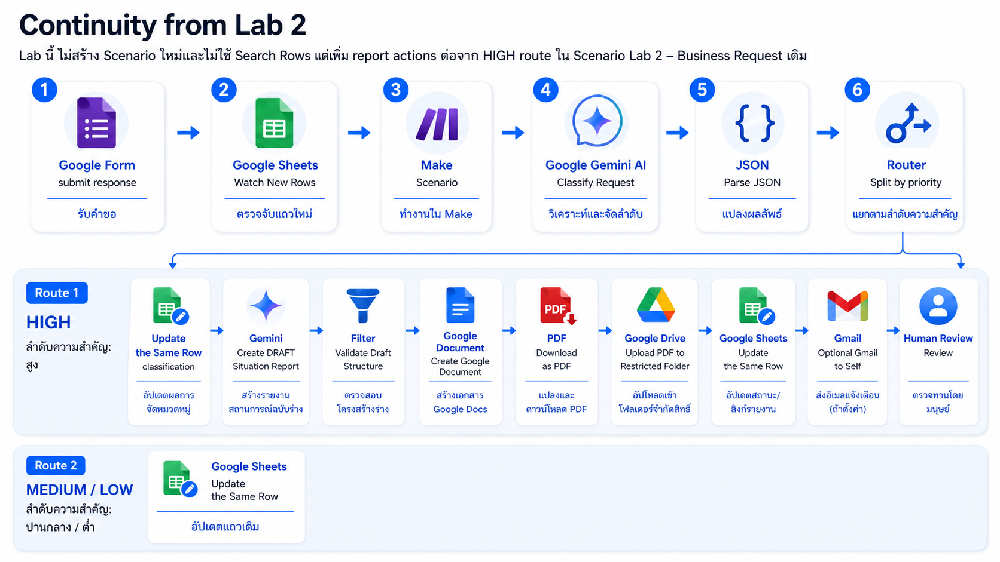
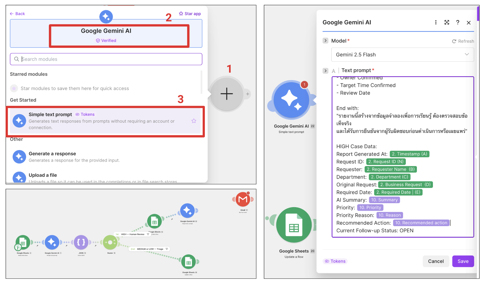
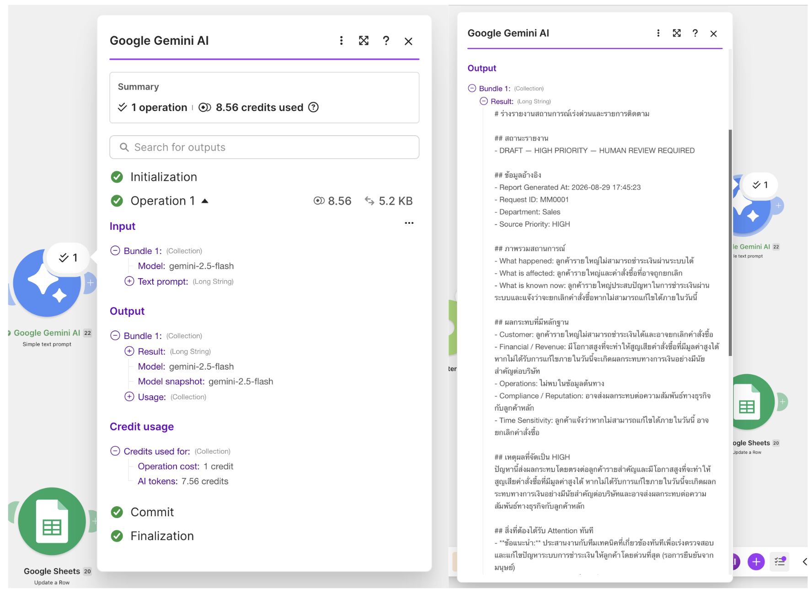
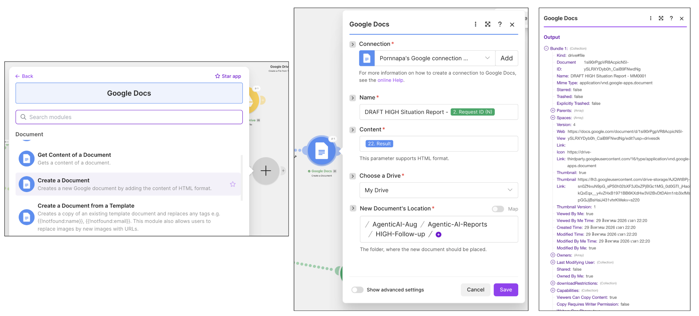
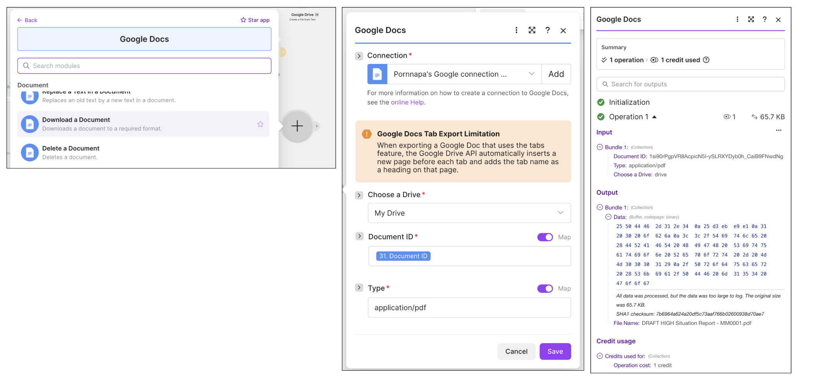
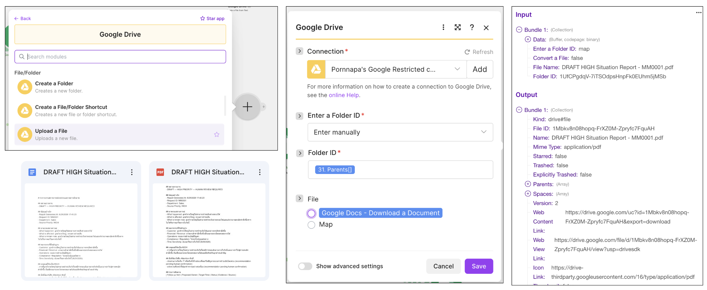
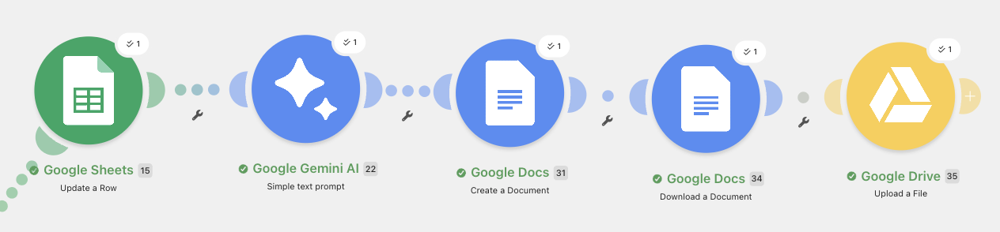
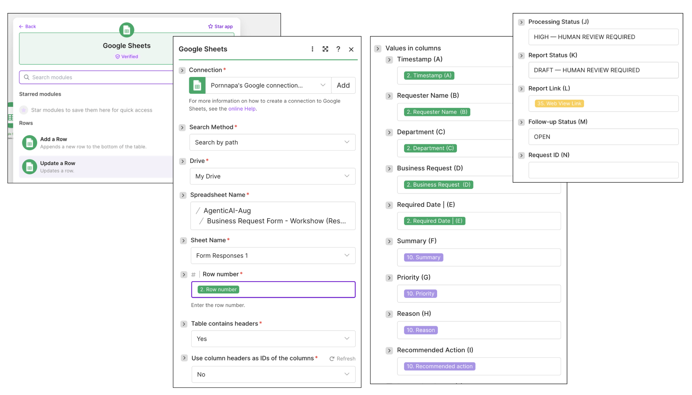
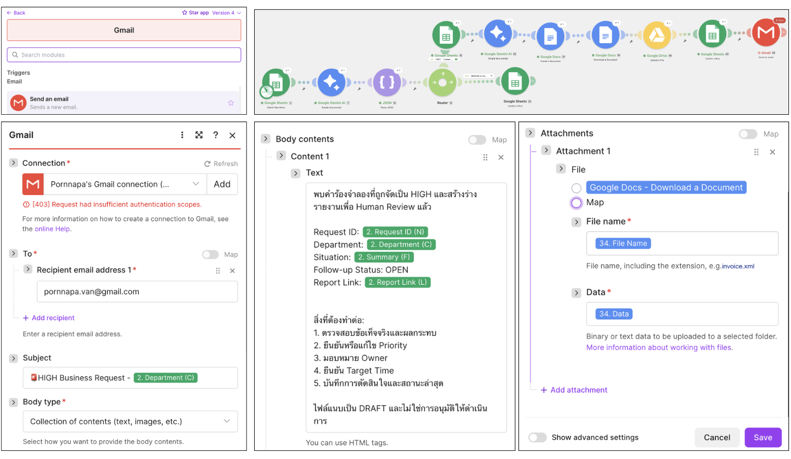

# Lab 3: Managerial AI — Extend the HIGH Route to Create a Follow-up PDF

[← Previous: Lab 2](../02-build-agentic-workflow/README.md) · [Home](../../README.md) · [Next: Antigravity →](../04-antigravity/README.md)

🎯 **Goal**  เปิด Scenario จาก Lab 2 แล้วต่อยอดเฉพาะเส้น `Priority = HIGH` ให้สร้างร่างรายงานสถานการณ์สำหรับ Manager, แปลงเป็น PDF, เก็บใน restricted folder และเขียนสถานะกลับแถวเดิม โดยยังต้องมี Human Review

🧰 **Tools**  Make + Google Forms + Google Sheets + Gemini + Google Drive; Gmail เป็น optional delivery

## Continuity from Lab 2

Lab นี้ **ไม่สร้าง Scenario ใหม่และไม่ใช้ Search Rows** แต่เพิ่ม report actions ต่อจาก HIGH route ใน Scenario `Lab 2 — Business Request` เดิม

```text
Google Form
↓
Google Sheets — Watch New Rows
↓
Gemini — Classify Request
↓
JSON — Parse JSON
↓
Router
├─ HIGH
│  → Update the Same Row (classification)
│  → Gemini — Create DRAFT Situation Report
│  → Filter — Validate Draft Structure
│  → Create Google Document
│  → Download as PDF
│  → Upload PDF to Restricted Folder
│  → Update the Same Row (report status/link)
│  → Optional Gmail to Self
│  → Human Review
│
└─ MEDIUM/LOW
   → Update the Same Row
```



การต่อจาก Router โดยตรงทำให้ใช้ `Row number`, ข้อมูลคำร้อง และผลวิเคราะห์จาก bundle ปัจจุบันได้ทันที ไม่ต้องค้นหา Request ID ซ้ำ

> รายงานคือ **Decision Support + Follow-up Artifact** ไม่ใช่คำสั่งอนุมัติ ไม่ใช่หลักฐานว่าสาเหตุได้รับการยืนยัน และไม่ใช่การแก้สถานการณ์อัตโนมัติ


## 📌 Step 1 — Prepare a Restricted Drive Folder

1. เปิด Google Drive ของบัญชีที่ใช้ทดสอบ
2. กด `New` → `New folder` แล้วสร้าง folder `Agentic-AI-Reports`
3. เปิด folder ดังกล่าวและสร้าง folder ย่อย `HIGH-Follow-up`
4. คลิกขวา `HIGH-Follow-up` → `Share`
5. ตรวจว่า `General access = Restricted`
6. ไม่เลือก `Anyone with the link` และไม่เพิ่มผู้รับจริงใน Workshop


## 📌 Step 2 — Reopen the Lab 2 Scenario

1. เปิด Make → `Scenarios`
2. เปิด Scenario `Lab 2 — Business Request`
3. ตรวจว่า Scheduling ยังเป็น `OFF`
4. หา HIGH route หลัง Router ซึ่งต้องมี filter `priority Equal to HIGH`
5. HIGH route ต้องมี `Google Sheets — Update a Row` จาก Lab 2 อยู่แล้ว
6. MEDIUM/LOW route ไม่ต้องแก้ไข

หาก HIGH route มี Gmail ต่อท้ายอยู่แล้ว ให้แทรก report modules ของ Lab 3 **ระหว่าง Update a Row กับ Gmail** เพื่อให้ Gmail ส่ง restricted link หรือแนบ PDF ได้ หาก UI แทรก module ระหว่างเส้นไม่ได้ ให้ย้าย Gmail ไปท้าย route หลังทำ Step 8


## 📌 Step 3 — Generate the DRAFT Situation Report

### Add the Module

1. ที่ HIGH route คลิก `+` หลัง `Google Sheets — Update a Row` จาก Lab 2
2. เลือก `Google Gemini AI`
3. เลือก `Simple Text Prompt` หรือ text-generation action ที่ทำหน้าที่เดียวกัน
4. เลือก Gemini connection และ model เดียวกับ Lab 2
5. Copy [HIGH Priority Situation Report Prompt](prompts.md#high-priority-situation-report-prompt) ลงช่อง Prompt

### Map the Current HIGH Bundle

แทน `{{HIGH_CASE_DATA}}` ด้วย tokens จาก `Watch New Rows` และ `Parse JSON` ใน Scenario เดิม:

```text
Report Generated At: {{current run time}}
Request ID: {{Request ID from Watch New Rows}}
Requester: {{Requester Name from Watch New Rows}}
Department: {{Department from Watch New Rows}}
Original Request: {{Business Request from Watch New Rows}}
Required Date: {{Required Date from Watch New Rows}}
AI Summary: {{summary from Parse JSON}}
Priority: {{priority from Parse JSON}}
Priority Reason: {{reason from Parse JSON}}
Recommended Action: {{recommended_action from Parse JSON}}
Current Follow-up Status: OPEN
```

ห้ามพิมพ์ Request ID เช่น `MM001` ค้างไว้ใน Prompt ให้ map token ของแถวปัจจุบัน เพื่อให้ทุก HIGH request ใช้ flow เดียวกันได้

> หาก `Request ID` เป็นสูตรใน Google Sheets ให้ตรวจว่า Watch New Rows คืนค่าออกมาแล้ว หาก token ยังว่าง ให้แก้สูตร/การเติมสูตรใน Sheet ก่อนทดสอบ PDF ไม่ควรใช้ Request ID ที่พิมพ์เองแทนแถวปัจจุบัน



## 📌 Step 4 — Run a Draft-only Test

ก่อนต่อ Drive modules ให้ทดสอบ flow ถึง Report Gemini ก่อน:

1. กด `Save` และตรวจ Scheduling = `OFF`
2. กด `Run once`
3. Submit คำร้องจำลองใหม่ที่เข้าเกณฑ์ HIGH ผ่าน Google Form
4. กลับ Make แล้วเปิด operation bubble ของ Report Gemini
5. อ่าน text output และตรวจว่ามี:
   - `DRAFT — HIGH PRIORITY — HUMAN REVIEW REQUIRED`
   - Request ID เดียวกับแถวที่เพิ่ง Submit
   - เหตุผลที่จัดเป็น HIGH จากข้อมูลต้นทาง
   - ข้อมูลที่ยังขาด
   - Human Review Sign-off
6. ตรวจว่าไม่มี owner, deadline, amount, SLA หรือ root cause ที่ข้อมูลต้นทางไม่ได้ให้
7. ตรวจว่าไม่มีคำว่า `RESOLVED`
8. ถ้าไม่ผ่าน ใช้ [Correction Prompt](prompts.md#correction-prompt) แล้ว Run once ด้วยคำร้องทดสอบใหม่

> Watch New Rows ประมวลผลแถวใหม่ จึงต้อง Submit test row หลังจากกด Run once ไม่ควรคาดหวังให้แถว HIGH เก่าจาก Lab 2 วิ่งเข้า module ที่เพิ่งเพิ่มโดยอัตโนมัติ




## 📌 Step 5 — Create a Google Document and Convert to PDF and Upload It

1. คลิก `+` หลัง validation filter
2. เลือก `Google Docs → Create a Document`
3. ตั้งค่าดังนี้:



4. คลิก `+` หลัง Google Docs เลือก `Google Docs → Download a Document`
5. ตั้งค่าดังนี้:


6. คลิก `+` หลัง Google Docs (Download a Document) เลือก `Google Drive → Upload a File`
7. ตั้งค่าดังนี้:



>ภาพรวม



## 📌 Step 6 — Update the Same Request Row

1. คลิก `+` หลัง Upload a File
2. เลือก `Google Sheets → Update a Row`
3. เลือก Spreadsheet และ Sheet เดียวกับ Lab 2
4. Map `Row number` จาก `Watch New Rows` ห้ามใช้ `Add a Row`
5. Map ค่าเดิมและผลวิเคราะห์กลับทุก column เพื่อป้องกันข้อมูลเดิมหาย:

| Update a Row field | Mapping / Value |
|---|---|
| Row number | `Row number` จาก Watch New Rows |
| Timestamp–Required Date | ค่าเดิมจาก Watch New Rows |
| Summary | `summary` จาก Parse JSON |
| Priority | `priority` จาก Parse JSON |
| Reason | `reason` จาก Parse JSON |
| Recommended Action | `recommended_action` จาก Parse JSON |
| Processing Status | `HIGH — HUMAN REVIEW REQUIRED` |
| Report Status | `DRAFT — HUMAN REVIEW REQUIRED` |
| Report Link | restricted web-view link จาก Upload a File |
| Follow-up Status | `OPEN` |
| Request ID | Request ID จาก Watch New Rows |



## 📌 Step 7 — Optional Gmail to Self

ข้ามขั้นนี้ได้หาก Gmail connection ไม่พร้อม PDF + tracker ที่อัปเดตแล้วถือว่าผ่าน Lab

1. ใช้ Gmail module เดิมจาก Lab 2 โดยย้ายมาไว้หลัง Report `Update a Row` หรือเพิ่ม `Gmail → Send an Email` ที่ท้าย HIGH route
2. ใส่ To เป็นอีเมลของตนเองเท่านั้น
3. ตั้ง Subject:

```text
[DRAFT][HIGH][Human Review] {{Request ID}} — โปรดติดตามสถานการณ์เร่งด่วน
```

4. Copy body จาก [Lab 3 Email Template](prompts.md#email-template)
5. Map Request ID จาก Watch New Rows, Department จาก Watch New Rows, Summary จาก Parse JSON และ restricted link จาก Upload a File
6. ถ้าต้องการแนบ PDF ให้ map File name และ Data จาก Download a File
7. ถ้า attachment mapping ไม่พร้อม ให้ส่ง restricted Drive link แทน
8. ตรวจว่า HIGH request หนึ่งรายการส่งอีเมลไม่เกินหนึ่งฉบับ



## 📌 Step 8 — Save and Run the Extended Scenario Once

1. กด `Save`
2. ตรวจ Scheduling = `OFF`
3. กด `Run once`
4. Submit คำร้องจำลองใหม่หนึ่งรายการที่คาดว่าเป็น HIGH
5. ไล่ตรวจ operation bubble ตั้งแต่ Watch New Rows ถึง Report Update a Row
6. Parse JSON ต้องได้ `priority = HIGH` และ HIGH route ต้องผ่านหนึ่ง bundle
7. MEDIUM/LOW route ต้องไม่ทำงานสำหรับ bundle นี้
8. Validation filter ต้องผ่านหนึ่ง bundle
9. PDF download/upload ต้องมี file data และขนาดมากกว่า 0
10. เปิด PDF จาก Drive และตรวจทุกหน้า
11. เปิด Business Request Log แล้วตรวจแถวของ Request ID เดียวกัน
12. ตรวจว่าไม่มี row ซ้ำ, ไม่มี PDF ของ MEDIUM/LOW และ Gmail ส่งไม่เกินหนึ่งฉบับ


---

[← Previous: Lab 2](../02-build-agentic-workflow/README.md) · [Home](../../README.md) · [Next: Antigravity →](../04-antigravity/README.md)
