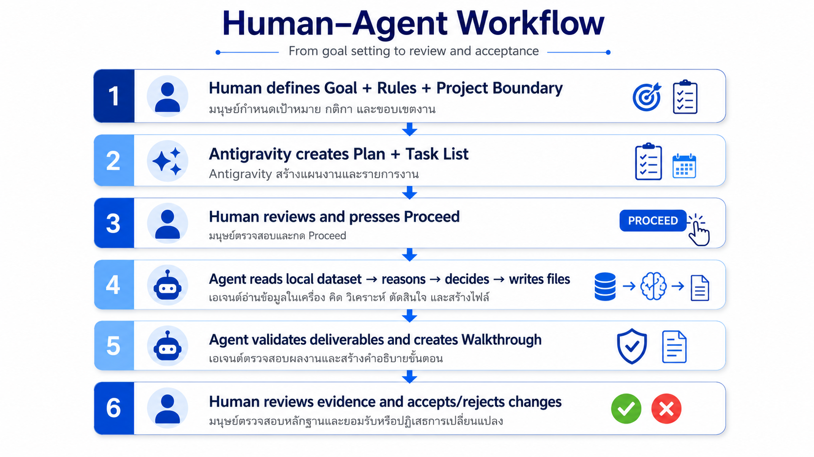
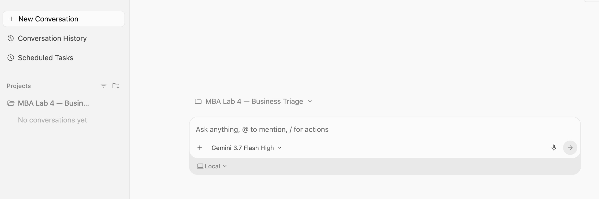
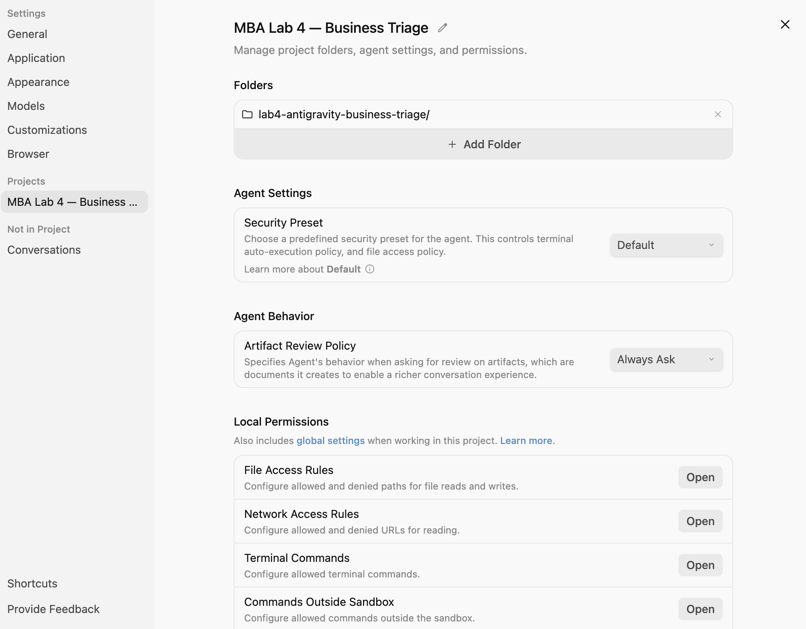
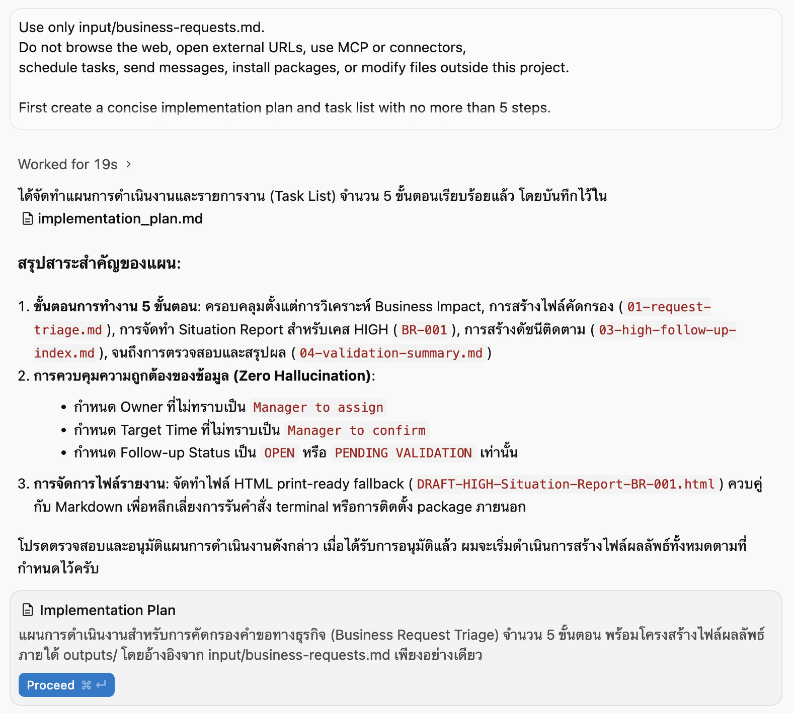
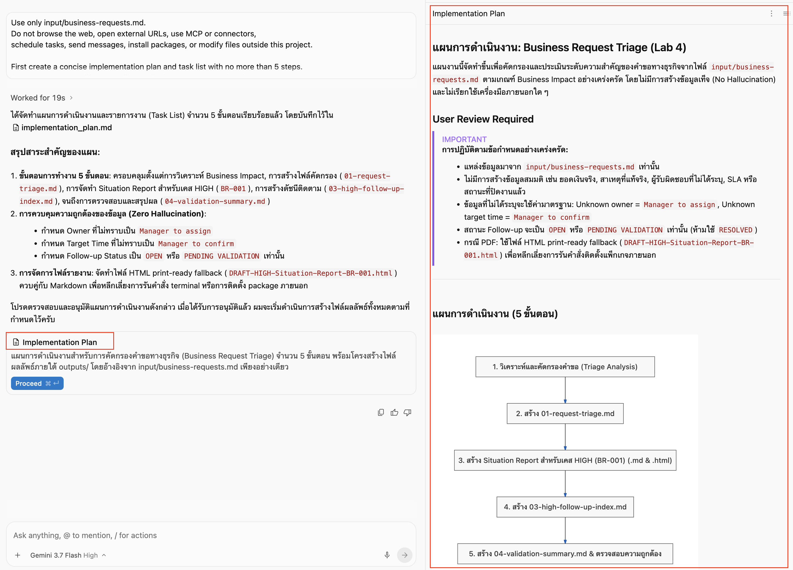

# Lab 4: Google Antigravity — One Bounded Agent Task

[← Previous: Lab 3](../03-generate-management-report/README.md) · [Home](../../README.md)

🎯 **Goal**  มอบงานเดียวให้ Google Antigravity: อ่านคำร้องจำลอง จัด Priority และสร้าง DRAFT management report หนึ่งไฟล์ โดย Agent วางแผนและใช้ local file tools เองภายในขอบเขตที่กำหนด

⏱ **เวลาโดยประมาณ**  15 นาที

🧰 **Tool**  [Google Antigravity](https://antigravity.google/) แบบ standalone desktop

Lab นี้เน้นประสบการณ์สั้น ๆ ของ `Goal → Plan → Tool Use → Artifact → Human Review` ผู้เรียนไม่ต้องเขียน code และไม่ต้องสร้าง Make Workflow

## สิ่งที่จะได้

Agent อ่าน:

```text
input/business-requests.md
```

แล้วสร้างเพียงไฟล์เดียว:

```text
outputs/business-request-management-report.md
```

ไฟล์เดียวนี้รวม:

- ตาราง Triage ของคำร้องทั้ง 4 รายการ
- รายละเอียด Situation & Follow-up เฉพาะรายการที่เป็น HIGH
- Quick Self-check สั้น ๆ ท้ายรายงาน

> Lab นี้ไม่สร้าง PDF/HTML, HIGH report แยกไฟล์, follow-up index หรือ validation summary เพราะ Lab 3 ฝึก document/PDF แล้ว และต้องการลดเวลาในห้อง

## Antigravity ใน Lab นี้ทำอะไร

Google Antigravity คือเครื่องมือ AI สำหรับช่วยทำงานแบบ AI Coding Agent ที่สามารถรับเป้าหมายจากเรา แล้วช่วย วางแผน เขียน/แก้โค้ด รันคำสั่ง และตรวจผลลัพธ์ ในโปรเจกต์ได้ 

>AI Agent ที่ช่วย “ลงมือทำงานในโปรเจกต์” ไม่ใช่แค่ตอบคำถามหรือสร้างข้อความ

```text
Human gives one bounded task
↓
Agent proposes a short plan
↓
Human checks scope and presses Proceed
↓
Agent reads one input file and creates one output file
↓
Human performs a quick review
```



Antigravity เป็น **bounded goal-based workspace agent** ใน Lab นี้: Agent เลือกลำดับการทำงานเอง แต่คนกำหนด input, output, permission และจุดอนุมัติ

| แนวคิด | การใช้ใน Lab 4 |
|---|---|
| Agent | รับ Goal, วางแผน, วิเคราะห์ และสร้าง report |
| Tool | อ่าน/เขียน local files ภายใน project |
| Connector / MCP | ไม่ใช้ |
| Guardrail | Dedicated folder, one input, one output, no network/external action และ Human Review |

## 📌 Step 1 — Prepare the Local Project

### 1.1 Create the Folder Structure

สร้าง folder บน Desktop ชื่อ `lab4-antigravity-business-triage` และสร้าง folder ย่อยดังนี้:

```text
lab4-antigravity-business-triage/
├── input/
└── outputs/
```

อย่าเลือก Desktop ทั้งหมด, Downloads, repository ใหญ่ หรือ folder งานจริงเป็น project scope

### 1.2 Add the Simulated Dataset

1. เปิด [business-requests.md](../templates/business-requests.md)
2. Save a copy หรือคัดลอกเนื้อหาไปไว้ที่:

```text
input/business-requests.md
```

3. ตรวจว่ามี Request ID `BR-001` ถึง `BR-004` อย่างละหนึ่งรายการ
4. ตรวจว่า `outputs/` ยังว่าง
5. ใช้เฉพาะข้อมูลจำลอง ห้ามแทนที่ด้วยข้อมูลจริง

✅ **Checkpoint**  Project มี input หนึ่งไฟล์และ output folder ว่าง

## 📌 Step 2 — Create the Antigravity Project

### 2.1 Select the Dedicated Folder

1. เปิด Google Antigravity และ Sign in ด้วยบัญชี Workshop
2. คลิก `Select Project` → `New Project`
3. คลิก `Add Folder`
4. เลือกเฉพาะ `lab4-antigravity-business-triage`
5. ตั้งชื่อ Project `MBA Lab 4 — Business Triage`
6. กด `Create`



### 2.2 Keep the Guardrails Simple

เปิด Project Settings แล้วตรวจเฉพาะค่าหลัก:

| Setting | Value |
|---|---|
| Project folder | Dedicated folder เพียงหนึ่งรายการ |
| Security Preset | `Default` |
| Artifact Review Policy | `Always Ask` หรือค่าที่ต้อง review ก่อนเปลี่ยนไฟล์ |
| Network / Browser | ไม่เพิ่ม permission |
| MCP / Connector | ไม่เพิ่ม |
| Terminal commands | ไม่จำเป็นสำหรับ Lab นี้ |

ไม่ต้องเพิ่ม File Access Rules, Network Access Rules, Terminal Commands หรือ Commands Outside Sandbox



✅ **Checkpoint**  Agent เห็นเฉพาะ dedicated project folder และยังต้องขอ review ก่อนเขียน artifact

## 📌 Step 3 — Send One Task

1. เปิด `New conversation` ภายใน Project นี้
2. เปิด [Primary Agent Task Prompt](prompts.md#primary-agent-task-prompt)
3. Copy prompt ทั้ง block แล้ว Paste ลง Antigravity
4. กด Send เพียงครั้งเดียวและรอ Agent แสดงแผน

### Prompt Preview

```text
Read only input/business-requests.md.
Create only outputs/business-request-management-report.md.

The single report must contain:
1. one triage table for all requests;
2. a DRAFT Situation & Follow-up section for HIGH requests only;
3. a short self-check.

Do not use web, connectors, MCP, terminal commands, packages,
messages, schedules, external actions, or files outside this project.

First show a plan of no more than 3 bullets and wait for approval.
Respond in Thai.
```

ใช้ Prompt ฉบับเต็มใน [prompts.md](prompts.md) เพราะมี Priority rules และข้อห้ามแต่งข้อมูล



### Quick Plan Review

ก่อนกด `Proceed` ตรวจเพียง 4 ข้อ:

- อ่านเฉพาะ `input/business-requests.md`
- สร้างเฉพาะ `outputs/business-request-management-report.md`
- Plan ไม่เกิน 3 bullets
- ไม่มี web, MCP, Connector, terminal, package หรือ external action

ถ้าครบ ให้ตอบด้วย [Plan Approval Response](prompts.md#plan-approval-response) แล้วกด `Proceed`

ถ้าไม่ครบ ให้ใช้ [Boundary Correction Prompt](prompts.md#boundary-correction-prompt)



✅ **Checkpoint**  Human ตรวจเฉพาะ scope ที่สำคัญก่อน Agent เริ่มเขียนไฟล์

## 📌 Step 4 — Let the Agent Complete the Task

หลังอนุมัติ ให้ Agent ทำงานจนจบ โดยไม่ต้องเปิดดูทุก task หรือทุก intermediate artifact

อนุมัติได้เฉพาะ:

- อ่าน `input/business-requests.md`
- สร้างหรือแก้ `outputs/business-request-management-report.md`

Reject หาก Agent ขอ:

- Network, browser หรือ URL
- Connector, MCP หรือ external API
- Terminal command หรือ package installation
- ส่ง email/message หรือสร้าง schedule
- อ่าน/เขียนไฟล์นอก project
- สร้าง output เพิ่มจากไฟล์ที่กำหนด

เมื่อจบ โครงสร้างต้องเป็น:

```text
lab4-antigravity-business-triage/
├── input/
│   └── business-requests.md
└── outputs/
    └── business-request-management-report.md
```

## 📌 Step 5 — Quick Review the One Report

เปิด `outputs/business-request-management-report.md` แล้วตรวจประมาณ 3–4 นาที:

- [ ] ตาราง Triage มี `BR-001` ถึง `BR-004` ครบและไม่ซ้ำ
- [ ] Priority มีเฉพาะ `HIGH`, `MEDIUM`, `LOW`
- [ ] `BR-004` ไม่เป็น HIGH เพียงเพราะมีคำว่า urgent/ASAP
- [ ] มี DRAFT Situation & Follow-up เฉพาะ HIGH case และมี source Request ID
- [ ] ไม่มีการแต่ง root cause, amount, owner, deadline, SLA หรือสถานะ RESOLVED
- [ ] Input ไม่ถูกแก้ ไม่มีไฟล์อื่นถูกสร้าง และ Agent ไม่อ้างว่าทำ external action แล้ว

หากสาระหลักถูกต้อง ให้ Accept/keep changes ได้ ไม่จำเป็นต้องแก้ถ้อยคำหรือรูปแบบเล็กน้อยจนสมบูรณ์แบบ

หากข้อสำคัญไม่ผ่าน ให้ส่ง Boundary Correction Prompt พร้อมระบุข้อที่ต้องแก้ในไฟล์เดิม ไม่ต้องเริ่ม Task ใหม่

✅ **Checkpoint**  ได้ management report หนึ่งไฟล์ที่ย้อนกลับไปหา source evidence ได้และยังอยู่ภายใต้ Human Review

## 📌 Step 6 — Compare with Make in 2 Minutes

| Criteria | Make — Lab 2–3 | Antigravity — Lab 4 |
|---|---|---|
| ลำดับขั้น | Human ต่อ modules/routes | Agent เสนอ plan จาก Goal |
| การเริ่มงาน | Form/Watch New Rows | Human เริ่ม conversation |
| ผลลัพธ์ | Sheet, PDF, Gmail | Local report หนึ่งไฟล์ |
| External action | ทำตาม workflow ที่กำหนด | ปิดใน Lab นี้ |
| เหมาะกับ | งานซ้ำและ event-driven | งานวิเคราะห์ one-off ที่มีขอบเขต |

คำถามสรุป:

1. ส่วนใดแสดงว่า Antigravity ทำงานแบบ Agent มากกว่า Chatbot?
2. ถ้างานนี้ต้องรันทุก 5 นาที เหตุใด Make จึงเหมาะกว่า?


---

[← Previous: Lab 3](../03-generate-management-report/README.md) · [Home](../../README.md)
